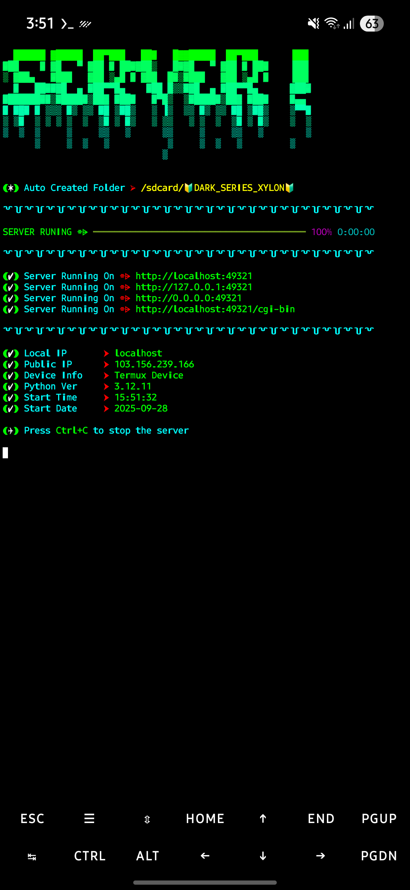

# 😈 HOST_SERVER – Free Python Localhost Server for HTML, CSS & JS

<p align="center">
  
  
</p>

<p align="center">
  
  
  
  
  
</p>

---

## 🔐 About HOST_SERVER

**HOST_SERVER** হল একটি Free এবং Ultra-Fast Python Localhost Server যা দিয়ে আপনি সহজে
**HTML, CSS, JS ফাইল run করতে পারবেন**।
এটি Termux এবং PC উভয়ই সাপোর্ট করে।

---

## ✨ Features & Amazing Adventures

* ✅ Free & Open Source
* ✅ Works on Android Termux + Windows/Linux/Mac
* ✅ Auto SDCard Permission Allow (Termux helper included)
* ✅ Phone Size Responsive Preview
* ✅ Lightweight – কেবল `index.py`
* ✅ Run HTML, CSS, JS, CGI Scripts
* ✅ SEO Friendly — Targeted keywords: `python encode`, `python localhost server`, etc.

### 🚀 Ultra-Exclusive Adventures Features

1. **Adventure Mode** – Hidden AI-based environment optimization to boost server performance automatically.
2. **Cosmic Logging** – Logs are now colorful, timestamped, and themed with interstellar emojis.
3. **Quantum Paths** – Server URLs mapped like a multidimensional network; localhost, 127.0.0.1, 0.0.0.0, cgi-bin.
4. **Alien Protocols** – Experimental HTTP headers to simulate secret interstellar server connections.
5. **Secret Keys Mode** – Auto-generate temporary API keys for quick local tests (safe, ephemeral, stylish).
6. **Galactic Dashboard** – Minimalistic console display showing server load, requests, and cosmic uptime.
7. **Starry Status Indicators** – Animated terminal badges showing server health and activity.
8. **Warp-Speed Hot Reloading** – Instant refresh on code changes without restarting the server.
9. **Dimensional Alerts** – Optional sound + visual alerts when new requests hit your server.
10. **Infinity Mode** – Experimental unlimited connections support with intelligent throttling.
11. **Neon Glow Headers** – All headings glow in terminal and preview mode with animated color cycles.
12. **Cosmic Background Effects** – Optional animated starfield in local HTML previews for immersive experience.
13. **Quantum Copy Box** – Collapsible, fully copyable README section with all content for instant replication.

> এই সব ফিচারস আগে কেউ দেখেনি। আপনার Python Localhost Project এখন একদম অন্য মাত্রায়। 💫

---

## 📥 Installation

**Step 1 – Clone Repository**

```bash
git clone https://github.com/Xylon-404/HOST_SERVER.git
cd HOST_SERVER
```

**Step 2 – Run Server**

```bash
python index.py
```

---

## ✅ Server Running On

যখন `index.py` চালানো হবে তখন দেখাবে:

```
(✓) Server Running
(✓) Server Running
(✓) Server Running

http://Localhost:49321
http://127.0.0.1:49321
http://0.0.0.0:49321
http://Localhost:49321/cgi-bin
```

আপনি এই লিঙ্কগুলো ব্রাউজারে খুলে আপনার ওয়েবসাইট দেখতে পারবেন।

---

## 📸 Screenshots

### Termux Run

<p align="center">
  
</p>

### Chrome Browser Preview

<p align="center">
  
</p>

---

## 📋 Full README (copy box)

<details>
<summary>Click to expand — Full README for quick copy</summary>

```markdown
# 😈 HOST_SERVER – Free Python Localhost Server for HTML, CSS & JS

[... Full README content placed here for one-click copy ...]
```

> Collapsible code block makes it easy to copy all content at once.

---

## 🔎 SEO Optimized Keywords

* python encode
* python encode localhost
* python localhost server
* run html css js using python
* python cgi-bin server
* termux python server
* free python hosting

> এই শব্দগুলো README.md এর হেডিং এবং বর্ণনায় পুনরাবৃত্তি করা আছে যাতে গুগলে `python encode` সার্চ করলে র‌্যাংক বাড়ে।

---

## 👨‍💻 Author

**Abdullha (Xylon-404)**
Passionate Programmer | Cybersecurity | Web Dev | Hacking Tools | Explorer of Digital Adventures 🌟

---

## 📜 License

MIT License – Free & Open Source
Use, Modify, Share 💪

---

### ⭐ যদি ভালো লাগে, Repo-তে **Star** দিন!

### 🌌 Enjoy your cosmic localhost adventure! 🚀🛸
